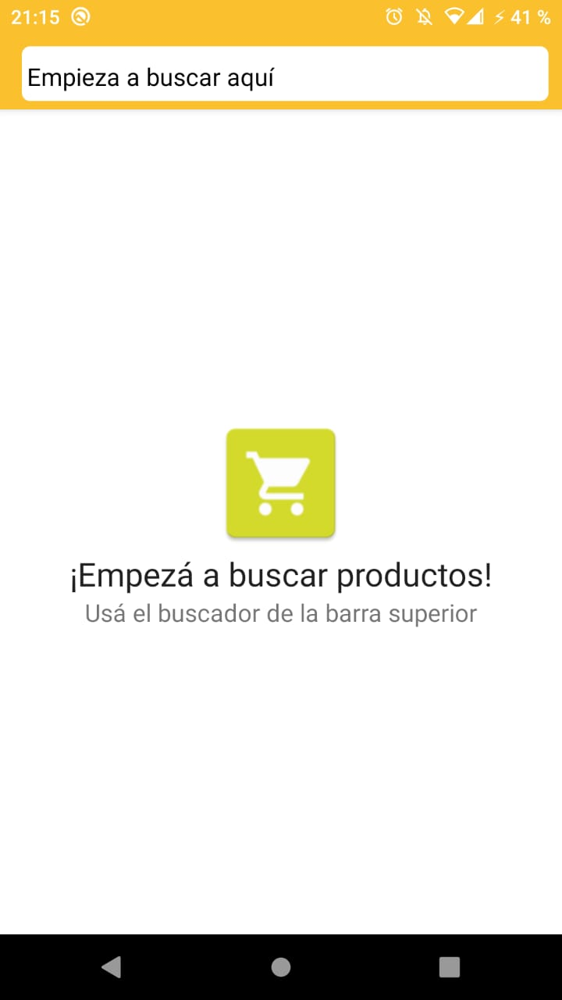
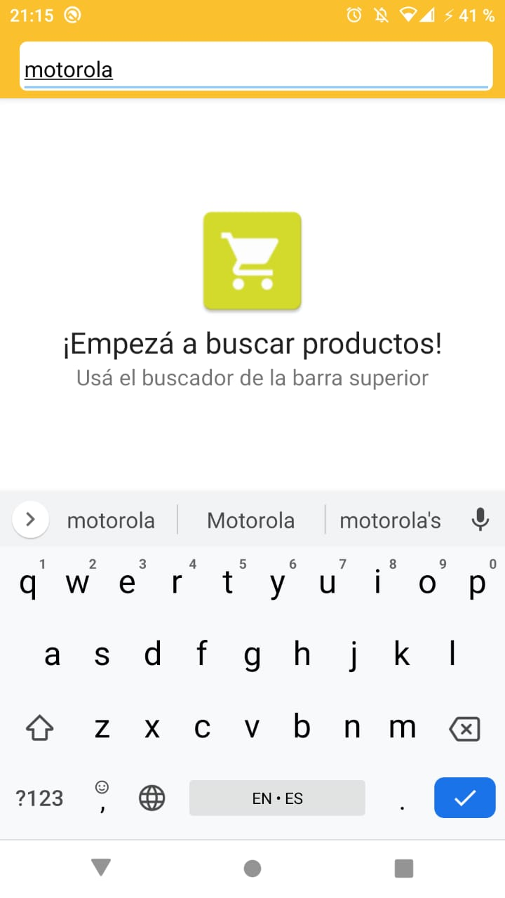
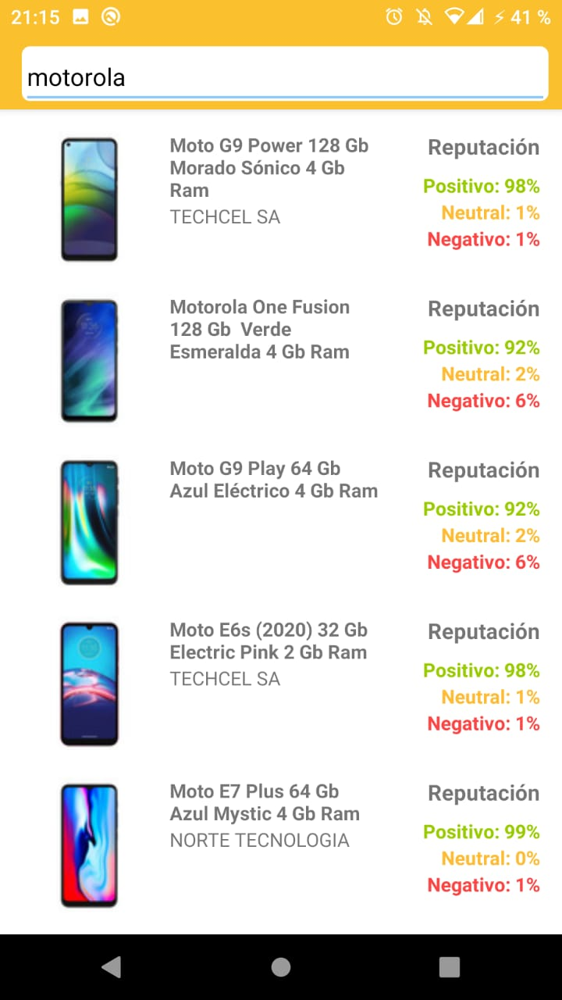
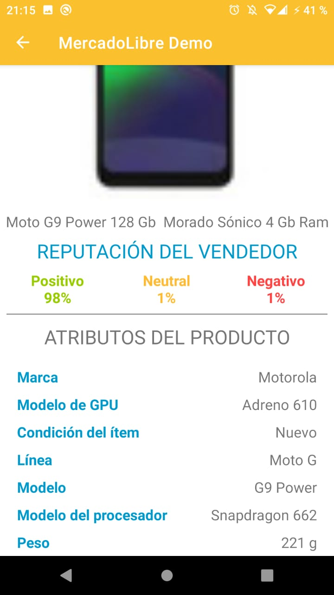

# MercadoLibre Demo App
This is an app for search a product using the MeLi API.

## Installation
 This is an Android Studio Project. You just clone the repo; next open in your IDE and run!

## Compatibility
This app was created with minimun API Level 16.

## Unit Test
You can run a couple of tests methods running the SearchUnitTest class.

## Features
- MVVM Pattern
- Toolbar searching
- Recyclerview with Viewholder
- Constraint Layout
- Retrofit 2
- Dark and Light Theme

## Screens
| Home | Search a Product | List of Products | Detail of a Product
|--|--|--|--|
|  |  |  |  |